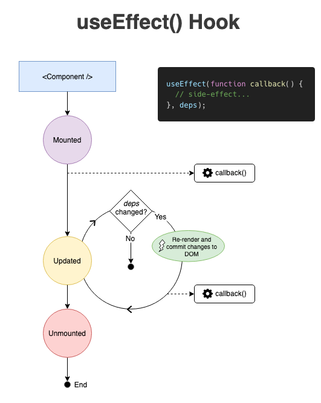

### Setup

```shell
yarn config set ignore-engines true 
yarn create react-app hello-react --template=typescript
yarn eject
yarn upgrade -R eslint 
# Prettier
yarn add eslint-config-prettier@8.3.0 eslint-plugin-prettier@4.0.0 prettier@2.3.2
# Redux toolkit
yarn add @reduxjs/toolkit@1.5.1 @types/react-redux@7.1.7 react-redux@7.2.0 axios@0.24.0
yarn create react-app my-app --template redux-typescript
```

- Add `.prettierrc`, `.eslintrc.json`, `.eslintignore`

`Eslint` is already added:

- https://github.com/facebook/create-react-app/blob/main/packages/eslint-config-react-app/package.json
- https://github.com/facebook/create-react-app/blob/main/packages/react-scripts/package.json#L46

```json
{
  "@typescript-eslint/eslint-plugin": "^4.30.0",
  "@typescript-eslint/parser": "^4.30.0",
  "babel-eslint": "^10.1.0",
  "eslint": "^7.32.0",
  "eslint-config-react-app": "^6.0.0",
  "eslint-plugin-flowtype": "^5.2.0",
  "eslint-plugin-import": "^2.22.1",
  "eslint-plugin-jest": "^24.1.0",
  "eslint-plugin-jsx-a11y": "^6.3.1",
  "eslint-plugin-react": "^7.21.5",
  "eslint-plugin-react-hooks": "^4.2.0",
  "eslint-plugin-testing-library": "^3.9.2",
  "eslint-webpack-plugin": "^2.5.2",
  "eslint-plugin-prettier": "4.0.0",
  "eslint-config-prettier": "8.3.0",
  "prettier": "2.3.2"
}
```


### Find `eslint-plugin-prettier` properly version

- Get currently eslint version: `yarn list eslint`

```shell
❯ yarn list eslint                                                                 
yarn list v1.22.4
warning Filtering by arguments is deprecated. Please use the pattern option instead.
└─ eslint@7.20.0
✨  Done in 0.73s.
```

- Check required eslint version by tag: https://github.com/prettier/eslint-plugin-prettier/blob/v3.3.1/package.json#L34

```shell
yarn add eslint-plugin-prettier@3.3.1 eslint-config-prettier@8.3.0 prettier@2.3.2
```

### Eslint and Prettier

- Eslint is linter prettier is formatter
- eslint-config-prettier : Turn off Eslint rules that is conflict with Prettier
- eslint-plugin-prettier : Integrate Prettier rules into Eslint rules

```json
{
  "extends": [
    "prettier"
  ],
  "plugins": [
    "prettier"
  ],
  "rules": {
    "prettier/prettier": [
      "error"
    ]
  }
}
```
## Props
- https://dmitripavlutin.com/react-props/
### Values of props

```tsx
// JSX:
<MyComponent prop={<Message who="Joker" />} />

// Variables having any kind of value:
<MyComponent prop={myVariable} />

// String literals:
<MyComponent prop="My String Value" />

// Template literals with variables:
<MyComponent prop={`My String Value ${myVariable}`} />

// Number literals:
<MyComponent prop={42} />

// Boolean literals:
<MyComponent prop={false} />

// Plain object literals:
<MyComponent prop={{ property: 'Value' }} />

// Array literals:
<MyComponent prop={['Item 1', 'Item 2']} />
```

### [Optional props](https://dmitripavlutin.com/react-props/#4-optional-props)
```tsx
function HelloOptional({ who = 'Unknown' }) {
  return <div>Hello, {who}!</div>;
}
```

### [Props spread syntax](https://dmitripavlutin.com/react-props/#5-props-spread-syntax)
```tsx
const hiBatman = { greet: 'Hi', who: 'Batman' };
function Message({ greet, who }) {
  return <div>{greet}, {who}!</div>;
}

<Message greet={hiBatman.greet} who={hiBatman.who} />

<Message {...hiBatman} />
```

### Children prop
```tsx
type Props = {
  children: React.ReactNode;
};

function Parent({ children }: Props) {
  console.log(children); // logs <span>I'm a child!</span>
  return <div>{children}</div>;
}

<Parent>
  <span>I'm a child!</span>
</Parent>
```
## Hook
### `useMemo`
- const memoizedResult = useMemo(compute, dependencies);
```tsx
const memoizedResult = useMemo(() => {
  return expensiveFunction(propA, propB);
}, [propA, propB]);
````
```tsx
export function CalculateFactorial() {
  const [number, setNumber] = useState(1);
  // const factorial = factorialOf(number);
  const factorial = useMemo(() => factorialOf(number), [number]);
  const onClick = () => setNumber(randomNumber);
  
  return (
    <div>
      <button onClick={onClick}>Re-render</button>
    </div>
  );
}
```
### `useContext`
- https://dmitripavlutin.com/react-context-and-usecontext/
- The React Context API is stateless by default and doesn’t provide a dedicated method to <ins>update</ins> the context value from consumer components.
```tsx
 const UserContext = createContext({
  userName: '',
  setUserName: () => {},
});
function Application() {
  const [userName, setUserName] = useState('John Smith');
  // Pass update sate function to context value
  const value = useMemo(
    () => ({ userName, setUserName }),
    [userName]
  );

  return (
    <UserContext.Provider value={value}>
      <UserNameInput />
      <UserInfo />
    </UserContext.Provider>
  );
}
function UserNameInput() {
  const { userName, setUserName } = useContext(UserContext);
  const changeHandler = event => setUserName(event.target.value);
  return (
    <input
      type="text"
      value={userName}
      onChange={changeHandler}
    />
  );
}
function UserInfo() {
  const { userName } = useContext(UserContext);
  return <span>{userName}</span>;
}
```

### `useEffect`

- https://dmitripavlutin.com/react-useeffect-explanation/
- Run when component is mounted and re-rendered.
- To run only when mounted. Pass empty array as second parameter.

```tsx
useEffect(() => {
  // This will execute EVERY every rendering
})

// Typically, use to fetch data
// https://dmitripavlutin.com/react-useeffect-explanation/#61-fetching-data
useEffect(() => {
  // This will execute ONCE after initial rendering (mounted)
}, [])

const [state, setState] = useState('');
useEffect(() => {
  // Runs ONCE after initial rendering
  // and after every rendering ONLY IF `prop` or `state` changes
}, [prop, state])

useEffect(() => {
  // Side-effect...
  return function cleanup() {
    // Side-effect cleanup...
  };
}, dependencies);
// Mounting: Run Effect
// Dependencies change: Cleanup → Run Effect
// Dependencies change: Cleanup → Run Effect
// Unmonting: Cleanup
// A) After initial rendering, useEffect() invokes the callback having the side-effect. cleanup function is not invoked.
// B) On later renderings, before invoking the next side-effect callback, useEffect() invokes the cleanup function from the previous side-effect execution (to clean up everything after the previous side-effect), then runs the current side-effect.
// C) Finally, after unmounting the component, useEffect() invokes the cleanup function from the latest side-effect.
useEffect(() => {
  const id = setInterval(() => { console.log(message); }, 2000);
  return () => { clearInterval(id); };
}, [message]);
``` 
- [Avoid infinity loop](https://dmitripavlutin.com/react-useeffect-infinite-loop/)
```tsx
useEffect(() => {
  // Infinite loop!
  setState(count + 1);
});
useEffect(() => {
  // No infinite loop
  setState(count + 1);
}, [whenToUpdateValue]);

useEffect(() => {
  // Infinite loop!
  setObject({
    ...object,
    prop: 'newValue'
  })
}, [object]);
useEffect(() => {
  // No infinite loop
  setObject({
    ...object,
    prop: 'newValue'
  })
}, [object.whenToUpdateProp]);
```

- Avoid pass async function as first parameter. Create async function and invoke it instead.

```tsx
useEffect(() => {
  async function fetchMyAPI() {
    let response = await fetch('api/data')
    response = await response.json()
    dataSet(response)
  }

  fetchMyAPI()
}, [])

async function fetchData() {
  const res = await fetch("https://swapi.co/api/planets/4/");
  res.json()
    .then(res => setPosts(res)) // update state
    .catch(err => setErrors(err)); // update state
}

useEffect(() => {
  fetchData();
}, []);
```

### `useRef`

- https://dmitripavlutin.com/react-useref-guide/
- Has null value when initialized and will not reset after re-rendered.
- Change ref value **_<ins>will not</ins>_** invoke component re-render.
- Value type of `useRef` can be value or DOM.

```tsx
const domRef = useRef<HTMLInputElement>(null);
const handleDomNodeChange = (domNode: HTMLInputElement | null) => {
  console.log(`Dom ref change: ${domNode}`);
};

return (
        <div>
          <input name="email" ref={domRef}/>
          <input name="name" ref={handleDomNodeChange}/>
        </div>
);

// Ref is null on initial rendering: https://dmitripavlutin.com/react-useref-guide/#ref-is-null-on-initial-rendering
const inputRef = useRef();
useEffect(() => {
  // Logs `HTMLInputElement` 
  console.log(inputRef.current);
  inputRef.current.focus();
}, []);
// Logs `undefined` during initial rendering
console.log(inputRef.current);
return <input ref={inputRef} type="text" />;
```

### Practice

#### [Multiple states](https://dmitripavlutin.com/react-usestate-hook-guide/#2-multiple-states)
We can store element in a variable: `bulb = <div className={on ? 'bulb-on' : 'bulb-off'}/>;`. See [Element Variables](https://reactjs.org/docs/conditional-rendering.html#element-variables)

```tsx
function Bulbs() {
  const [on, setOn] = useState(false);
  const [count, setCount] = useState(1);
  const lightSwitch = () => setOn(on => !on);
  const addBulbs = () => setCount(count => count + 1);
  // Element variable
  const bulb = <div className={on ? 'bulb-on' : 'bulb-off'}/>;
  const bulbs = Array(count).fill(bulb);
  return (
          <>
            <div className="bulbs">{bulbs}</div>
            <button onClick={lightSwitch}>On/off</button>
            <button onClick={addBulbs}>Add bulb</button>
          </>
  );
}

const COLORS = ['white', 'red', 'blue', 'black', 'cream'];
function RegisterYourCatForm() {
  return (
    <select>
      <option value="">Select color</option>
      {COLORS.map(c => <option key={c}>{c}</option>)}
    </select>
  );
}
```
#### [Lazy initialization of state](https://dmitripavlutin.com/react-usestate-hook-guide/#3-lazy-initialization-of-state)
```tsx
interface Props {
    bigJsonData: string;
}
function MyComponent({ bigJsonData }: Props) {
  const [value, setValue] = useState(function getInitialState() {
    const object = JSON.parse(bigJsonData); // expensive operation
    return object.initialValue;
  });
}
```
#### [Making the component orthogonal to fetch details](https://dmitripavlutin.com/orthogonal-react-components/#3-making-the-component-orthogonal-to-fetch-details)
The problem with the current implementation is that <EmployeesPage> depends on how data is fetched.
```tsx
function EmployeesPage() {
  const [isFetching, setFetching] = useState(false);
  const [employees, setEmployees] = useState([]);
  
  // This should be put in another place
  useEffect(function fetch() {
    (async function() {
      setFetching(true);
      const response = await axios.get("/employees");
      setEmployees(response.data);
      setFetching(false);
    })();
  }, []);
  
  if (isFetching) {
    return <div>Fetching employees....</div>;
  }
  
  return <EmployeesList employees={employees} />;
}
```

```tsx
function EmployeesPage({resource}) {
  return (
    <Suspense fallback={<h1>Fetching employees....</h1>}>
      <EmployeesFetch resource={resource}/>
    </Suspense>
  );
}

function EmployeesFetch({resource}) {
  const employees = resource.employees.read();
  return <EmployeesList employees={employees}/>;
}
```

#### Implement scroll to top with custom hook
```tsx
import React, { useState, useEffect } from 'react';
const DISTANCE = 500;
function ScrollToTop() {
  const [crossed, setCrossed] = useState(false);
  useEffect(
    function() {
      const handler = () => setCrossed(window.scrollY > DISTANCE);
      handler();
      window.addEventListener("scroll", handler);
      return () => window.removeEventListener("scroll", handler);
    },
    []
  );
  function onClick() {
    window.scrollTo({
      top: 0,
      behavior: "smooth"
    });
  }
  if (!crossed) {
    return null;
  }
  return <button onClick={onClick}>Jump to top</button>;
}
```

```tsx
// Custom hook
function useScrollDistance(distance) {
  // Invoke component re-render will crossed change
  const [crossed, setCrossed] = useState(false);
  
  // We use useEffect to register window.addEventListener
  useEffect(function() {
    const handler = () => setCrossed(window.scrollY > distance);
    handler();
    window.addEventListener("scroll", handler);
    return () => window.removeEventListener("scroll", handler);
  }, [distance]);
  
  return crossed;
}

function IfScrollCrossed({ children, distance }) {
  const isBottom = useScrollDistance(distance);
  return isBottom ? children : null;
}

function onClick() {
  window.scrollTo({
    top: 0,
    behavior: 'smooth'
  });
}
function JumpToTop() {
  return <button onClick={onClick}>Jump to top</button>;
}

const DISTANCE = 500;
function MyComponent() {
  return (
    <IfScrollCrossed distance={DISTANCE}>
      <JumpToTop />
    </IfScrollCrossed>
  );
}
```

####  [Extract complex state logic](https://dmitripavlutin.com/react-state-management/#2-extract-complex-state-logic)
```tsx
function ProductsList() {
  const [names, setNames] = useState([]);
  const handleAdd = () => {
    const s = new Set([...names, newName]);
    setNames([...s]);
  };
  return (
    <div className="products">
      <button onClick={handleAdd}>Add</button>
    </div>
  );
}

// Custom hook
export function useUnique(initial) {
  const [items, setItems] = useState(initial);
  // invoke add(newItem) will trigger component re-render 
  const add = newItem => {
    const uniqueItems = [...new Set([...items, newItem])];
    setItems(uniqueItems);
  };
  return [items, add];
};

function ProductsList() {
  const [names, add] = useUnique([]);
  // add(newName) will trigger component re-render
  const handleAdd = () => add(newName);
  return (
    <div className="products">
      <button onClick={handleAdd}>Add</button>
    </div>
  );
}
```
### Mistake

#### [Do Not change hooks invocation order](https://dmitripavlutin.com/react-hooks-mistakes-to-avoid/#1-do-not-change-hooks-invocation-order) 
Invoking hooks must be the same order between renderings — always!

```tsx
function FetchGame({id}) {
  // Don't do this
  // if (!id) {
  //   return 'Please select a game to fetch';
  // }
  const [game, setGame] = useState({
    name: '',
    description: ''
  });
  useEffect(() => {
    const fetchGame = async () => {
      const response = await fetch(`/api/game/${id}`);
      const fetchedGame = await response.json();
      setGame(fetchedGame);
    };
    if (id) {
      fetchGame();
    }
  }, [id]);
  if (!id) {
    return 'Please select a game to fetch';
  }
  return (
          <div>
            <div>Name: {game.name}</div>
            <div>Description: {game.description}</div>
          </div>
  );
}
```
#### [Do Not use stale state](https://dmitripavlutin.com/react-hooks-mistakes-to-avoid/#1-do-not-change-hooks-invocation-order)

Using `setCount(count => count + 1);` instead of `setCount(count + 1);`.

Other example: https://dmitripavlutin.com/react-usestate-hook-guide/#42-stale-state

#### [Do Not create stale closures](https://dmitripavlutin.com/react-hooks-mistakes-to-avoid/#3-do-not-create-stale-closures)

`setInterval` still invokes the <ins>**old**</ins> `log` closure that has captured count as 0 from the initial rendering.

`log` is a `stale closure` because it has captured a stale (in other words <ins>**outdated**</ins>) state variable count.
```tsx
// Don't do this.
const [count, setCount] = useState(0);
useEffect(function () {
  setInterval(function log() {
    console.log(`Count is: ${count}`);
  }, 2000);
}, []);
```

Using a `useEffect` cleaner function. 
```tsx
useEffect(function () {
  const id = setInterval(function log() {
    console.log(`Count is: ${count}`);
  }, 2000);
  return () => clearInterval(id);
}, [count]);
```
### Reference

- https://issueexplorer.com/issue/prettier/eslint-plugin-prettier/434
- https://viblo.asia/p/su-dung-prettier-ket-hop-voi-eslint-bWrZnwkwlxw
- Eslint 7.32 [CharlesStover/charlesstover.com](https://github.com/CharlesStover/charlesstover.com/blob/1fef52f3616173c81d8b6e95f55cb817bd055ca1/package.json)
-Eslint `8.0.1` [CharlesStover/charlesstover.com](https://github.com/CharlesStover/charlesstover.com/blob/main/package.json#L74)
- https://dev.to/viniciusmdias/easy-start-of-a-typescript-react-project-w-eslint-and-prettier-55d4
- https://www.alexey-nikiforov.name/setup-react-app-with-typescript-eslint-and-prettier
- https://dev.to/suprabhasupi/learn-to-configure-eslint-and-prettier-in-react-4gp0
- https://dev.to/mehmehmehlol/class-components-vs-functional-components-in-react-4hd3
