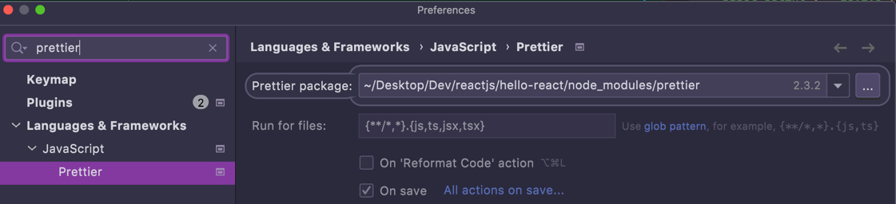

### Setup
```shell
yarn config set ignore-engines true 
yarn create react-app hello-react --template=typescript
yarn eject
yarn upgrade -R eslint 
# Prettier
yarn add eslint-config-prettier@8.3.0 eslint-plugin-prettier@4.0.0 prettier@2.3.2
```
- Add `.prettierrc`, `.eslintrc.json`, `.eslintignore` 

`Eslint` is already added: 
- https://github.com/facebook/create-react-app/blob/main/packages/eslint-config-react-app/package.json
- https://github.com/facebook/create-react-app/blob/main/packages/react-scripts/package.json#L46

```json
{
  "@typescript-eslint/eslint-plugin": "^4.30.0",
  "@typescript-eslint/parser": "^4.30.0",
  "babel-eslint": "^10.1.0",
  "eslint": "^7.32.0",
  "eslint-config-react-app": "^6.0.0",
  "eslint-plugin-flowtype": "^5.2.0",
  "eslint-plugin-import": "^2.22.1",
  "eslint-plugin-jest": "^24.1.0",
  "eslint-plugin-jsx-a11y": "^6.3.1",
  "eslint-plugin-react": "^7.21.5",
  "eslint-plugin-react-hooks": "^4.2.0",
  "eslint-plugin-testing-library": "^3.9.2",
  "eslint-webpack-plugin": "^2.5.2",
  
  "eslint-plugin-prettier": "4.0.0",
  "eslint-config-prettier": "8.3.0",
  "prettier": "2.3.2"
}
```


### Eslint and Prettier
- Eslint is linter prettier is formatter
- eslint-config-prettier : Turn off Eslint rules that is conflict with Prettier
- eslint-plugin-prettier : Integrate Prettier rules into Eslint rules
```json
{
  "extends": ["prettier"],
  "plugins": ["prettier"],
  "rules": {
    "prettier/prettier": ["error"]
  }
}
```
